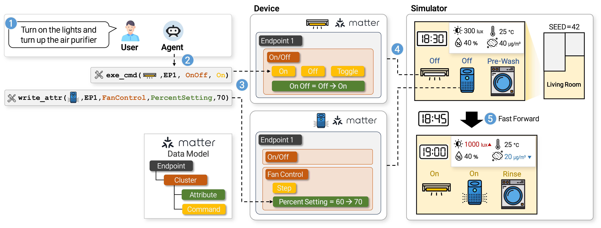

<p align="center">
  
</p>

# [ICLR26 Oral] SimuHome: A Temporal- and Environment-Aware Benchmark for Smart Home LLM Agents

[](https://arxiv.org/abs/2509.24282)
[](https://www.python.org/downloads/)
[](https://creativecommons.org/licenses/by-nc-nd/4.0/)

**SimuHome** is a time-accelerated smart home simulator and benchmark for LLM-based agents, grounded in the [Matter](https://csa-iot.org/all-solutions/matter/) protocol. Device actions continuously affect environmental variables (e.g., temperature, humidity), and agents must reason over these changes. It also supports virtual-time workflow scheduling, so agents can queue multi-step actions for future execution and coordinate them with time-sensitive goals.

<p align="center">
  
</p>

------

## Quick Start

### 1. Install

```bash
pip install uv
git clone https://github.com/holi-lab/SimuHome.git
cd SimuHome
uv sync
```

### 2. Set API Keys

Create `.env` in the project root:

```bash
OPENAI_API_KEY=your_openai_key_here            # Required
OPENROUTER_API_KEY=your_openrouter_key_here    # Required for default eval_spec.example.yaml
```

If you use only local models (with `api_key: null`), you can omit `OPENROUTER_API_KEY`.

### 3. Start the Simulator

```bash
uv run simuhome server-start   # Launch simulator on port 8000
uv run simuhome health         # Verify it's running
```

------

## Evaluation

The benchmark dataset is pre-included in `data/benchmark/`.

**1. Configure** `eval_spec.example.yaml`:

<details>
<summary><b>eval_spec.example.yaml</b></summary>

```yaml
schema: simuhome-eval-spec-v1

run:
  id: example_qt1_seed_1_3_5
  output_root: experiments

episode:
  dir: data/benchmark
  qt: qt1
  case: feasible
  seed: "1 - 3, 5"

strategy:
  name: react
  timeout: 60
  temperature: 0.0
  max_steps: 20

orchestration:
  max_workers: 2
  simulator_start_timeout: 30
  simulator_start_retries: 1
  evaluation_retries: 1
  allow_partial_start: true

api:
  base: https://api.openai.com/v1
  key: env:OPENAI_API_KEY

judge:
  model: gpt-5-mini
  api_base: https://api.openai.com/v1
  api_key: env:OPENAI_API_KEY

models:
  - model: openai/gpt-4.1
    api_base: https://openrouter.ai/api/v1
    api_key: env:OPENROUTER_API_KEY

  - model: qwen3-30b-instruct
    api_base: http://127.0.0.1:8000/v1
    api_key: null
```

</details>

**2. Run:**

```bash
uv run simuhome eval-start --spec eval_spec.example.yaml
uv run simuhome eval-resume --resume experiments/<run_id>    # Resume if interrupted
```

**3. Aggregate results:**

```bash
uv run simuhome aggregate --dir experiments/<run_id>/<model>
uv run simuhome aggregate-all --dir experiments/<run_id>
```

------

## Episode Generation

Generate custom episodes beyond the included benchmark.

**1. Configure** `gen_spec.example.yaml`:

<details>
<summary><b>gen_spec.example.yaml</b></summary>

```yaml
schema: simuhome-gen-spec-v1

run:
  id: gen_example_qt1_seed_1_3_5
  output_root: experiments

episode:
  qt: qt1
  case: feasible
  seed: "1-3,5"
  base_date: "2025-08-23"
  home:
    room_count: 5
    devices_per_room:
      min: 4
      max: 7
    environment:
      temperature_c:  # Temperature in Celsius (allowed: 18.0-36.0)
        min: 22
        max: 32
      humidity_pct:  # Humidity in percent (allowed: 15.0-85.0)
        min: 35
        max: 65
      illuminance_lux:  # Illuminance in lux (allowed: 10.0-3000.0)
        min: 100
        max: 1500
      pm10_ugm3:  # PM10 in ug/m3 (allowed: 5.0-120.0)
        min: 20
        max: 100

llm:
  model: gpt-5-mini
  api_base: https://openrouter.ai/api/v1
  api_key: env:OPENROUTER_API_KEY
  temperature: 1  # Sampling temperature (gpt-5-mini requires 1)
```

</details>

**2. Run:**

```bash
uv run simuhome episode --spec gen_spec.example.yaml
uv run simuhome episode-resume --resume experiments/<run_id>  # Resume if interrupted
```

------

## Citation

```bibtex
@inproceedings{
  seo2026simuhome,
  title={SimuHome: A Temporal- and Environment-Aware Benchmark for Smart Home {LLM} Agents},
  author={Gyuhyeon Seo and Jungwoo Yang and Junseong Pyo and Nalim Kim and Jonggeun Lee and Yohan Jo},
  booktitle={The Fourteenth International Conference on Learning Representations},
  year={2026},
  url={https://openreview.net/forum?id=LCS1WsGvha}
}
```

------

## License

This project is licensed under [CC BY-NC-ND 4.0](https://creativecommons.org/licenses/by-nc-nd/4.0/).  
You may share this work for non-commercial purposes with appropriate credit. Commercial use and derivative works are not permitted.
